# My Code School

## Data Structures

### 21) Infix to Postfix using stack

(example of the use of stack - infix to postfix)

### 22) Data structures: Introduction to Queues

ADT - abstract data type - features/operations, not implementation.

Queue - **first-in-first-out (FIFO)**. Queue is a list or collection with the restriction that insertion can be performed at one end (rear) and deletion can be performed at other end (front).

Operations:

1) EnQueue(x) or Push(x);
2) DeQueue() or Pop();
3) front() or peak() - return element at the front;
4) IsEmpty();

The time conplexity of the operations should be O(1).

```C
void Enqueue(int x);
int Dequeue();
```


Queue is most often used in a scenario where there is a **shared resource** that's supposed to serve some request, but the resource can handle only one request at a time.

### 23) Data structures: Array implementation of Queue

We can implement queues using:

1) Arrays;
2) Linked Lists;

#### Array Implementation

```C++
int A[10];
front = -1;
rear  = -1;

isEmpty()
{
    if (front == -1 && rear == -1)
        return true;
    else
        return false;
}

enqueue(x)
{
    if isFull()
        return
    else if isEmpty()
    {
        front <- rear <- 0
    }
    else
    {
        rear <- rear + 1
    }
    A[rear] <- x
}

dequeu()
{
    if isEmpty()
        return;
    else if front == rear
        front <- rear <- -1
    else
        front <- front + 1
}

// circular interpretation of the arrray/queue
enqueue(x)
{
    if(rear + 1) % N == front
        return
    else if isEmpty()
    {
        front <- rear <- 0
    }
    else
    {
        rear <- (rear + 1) % N
    }
    A[rear] <- x
}

// dequeue in circular interpretation
dequeu()
{
    if isEmpty()
        return
    else if front == rear
        front <- raer <- -1
    else
        front <- (front + 1) % N
}

front()
{
    return A[front]
}
```

Time complexity - O(1).

What if array gets filled?

1) "sorry, queue is full"
2) Create a new array and copy data

### 24) Data structures: Linked List implementation of Queue

#### Linked List Implementation

Enqueue: O(n), Dequeue: O(1).

```C++
struct Node{
    int data;
    struct Node* next;
};

struct Node* front = NULL;
struct Node* rear = NULL;

void Enqueue(int x)
{
    struct Node* temp = (struct Node*)malloc(sizeof(struct Node*));
    temp->data = x;
    temp->next = NULL;
    if(front == NULL && rear == NULL){
        front = rear = temp;
        return;
    }
    rear->next = temp;
    rear = temp;
}

void Dequeue()
{
    struct Node* temp = front;
    if(front == NULL) return;
    if(front == rear){
        front = rear = NULL;
    }else{
        front = front->next;
    }

    free(temp);
}
```

### 25) Data structures: Introduction to Trees

Linear data structures: array, linked list, stack and queue.

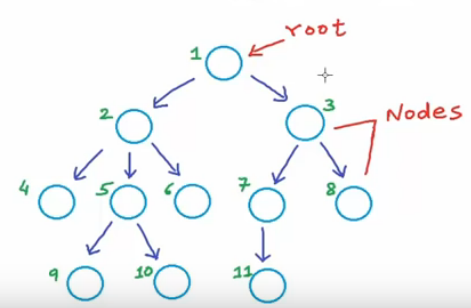

Tree: recursive data structure.

**Depth** of x = lenght of path from root to x or number of edges in path from root to x. For example, the depth of root is zero. **Height** of x = number of edges in longest path from x to a leaf.

```C++
struct Node {
    int data;
    Node* left;
    Node* right;
};
```

Applications:

1) Storing naturally hierarchical data. Eg: - file system;
2) Organize data for quick search, insertion, deletion: eg: - binary serach trees;
3) Trien - dictionary;
4) Networking routing algorithms;

### 26) Data structures: Binary Tree


**Binary tree**: each node can have at most 2 children; **Strict/proper** binary tree: each node can have either 2 or 0 children;**Complete binary tree**: all levels except possibly the last are completely filled and all nodes are as left as possible;

Depth example:

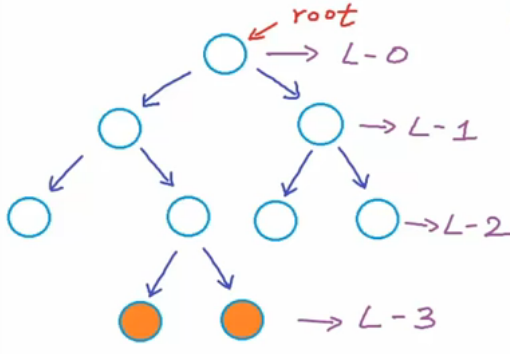

Maximum number of nodes at level ```i```: ```i = 2^i```.

**Perfect binary tree**: all levels are complete:

- maximum number of nodes in a binary tree with height *h*: ```h = 2^(h + 1) - 1```;
- height of perfect binary tree with *n* nodes: ```h = log2(n + 1) - 1```;
- height of complete binary tree: ```h = |log2n|```;

**Balanced binary tree**: difference between height of left and right subtree for every node is not more than *k* (mostly 1). **Height**: number of edges in longest path from root to a leaf; Height of and empty tree = -1; height of tree with 1 node = 0; is valid: ```diff = |Hleft - Hright|```;


We can implement binary tree using:

#### a) dynamically created nodes

```C++
struct Node{
    int data;
    Node* left;
    Node* right;
};
```

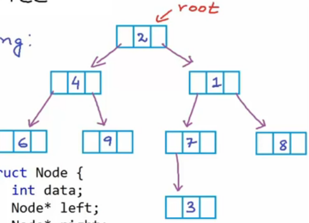

#### b) arrays

![tree array]](img/tree-array.png)

```C
for node at index i,
    left-child-index = 2i + 1
    right-child-index = 2i + 2
```

### 27) Data structures: Binary Search Tree

Binary search tree is an efficient structure to organize data for quick search as well as quick update.

- What data structure will you use to store a modifiable collection?

1) Array (sorted) - Search(x) = O(n), Insert(x) = O(1) and Remove(x) = O(n);
2) Linked List - Search(x) = O(n), Insert(x) = O(1) and Remove(x) = O(n);
3) Array (unsorted) - Search(x) = O(log(n)), Insert(x) = O(n) and Remove(x) = O(n);
4) Binary Search Tree (balanced) - Search(x) = O(log(n)), Insert(x) = O(log(n)), Remove(x) = O(log(n));

**Binary Search Tree (BST)** -  a binary tree in which for each node, value of all the nodes in left subtree is lesser (or equal) and value of all the nodes in right subtree is greater.


### 28) Binary search tree - Implementation in C/C++

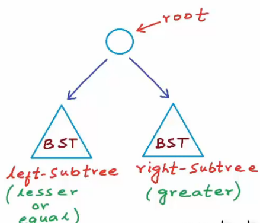

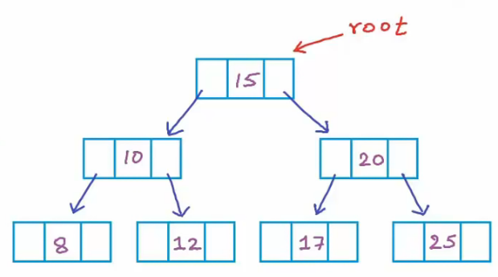

```C++
struct BstNode {
    int data;
    BstNode* left;
    BstNode* right;
}

BstNode* rootPtr;

BstNode* GetNewNode(int data)
{
    BstNode* newNode = new BstNode(); // C++
    // BstNode* newNode = (BstNode*)malloc(sizeof(BstNode));
    newNode->data = data; // (*newNode).data = data
    newNode->left = newNode->right = NULL;
    return newNode;
}

BstNode* Insert(BstNode* root, int data)
{
    if(root == NULL){
        root = GetNewNode(data);
    }
    else if(data <= root->data){
        root->left = Insert(root->left, data);
    }
    else{
        root->right = Insert(root->right, data);
    }
    return root;
}

bool Search(BstNode* root, int data)
{
    if(root == NULL) return false;
    else if(root->data == data) return true;
    else if(data <= root->data) return Search(root->left, data);
    else return Search(root->right, data);
}

int main()
{
    BstNode* root = NULL; // creating empty tree
    root = Insert(root, 15);
    root = Insert(root, 10);
    root = Insert(root, 20);
    root = Insert(root, 25);
    root = Insert(root, 8);
    root = Insert(root, 12);

    // ask user to enter a number
    int number;
    cout << "Enter a number to be searched: ";
    cin >> number;
    if(Search(root, number) == true) cout << "Found\n";
    else cout << "Not Found\n";
}
```

Nodes will be created in heap using ```malloc``` function in C or ```new``` operator in C++.

### 29) BST implementation - memory allocation in stack and heap

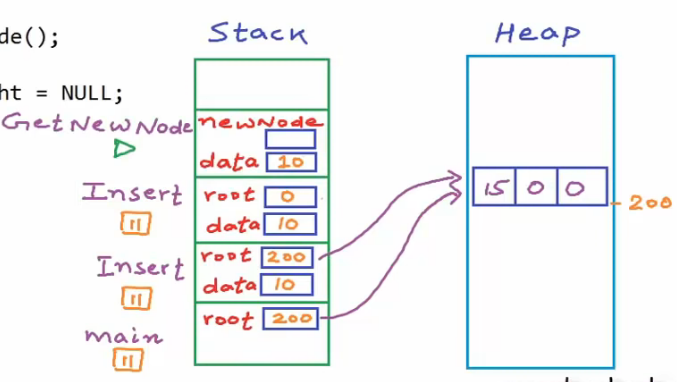

### 30) Find min and max element in a binary search tree

```C++
struct BstNode {
    int data;
    BstNode* left;
    BstNode* right;
};

// iterative solution
int FindMin(BstNode* root)
{
    if(root == NULL)
    {
        cout << "Error: Tree is empty!\n";
        return -1;
    }
    while(root->left != NULL)
    {
        root = root->data;
    }
}

// recursive solution
int FindMin(BstNode* root)
{
    if(root == NULL)
    {
        cout << "Error: Tree is empty!\n";
        return -1;
    }
    else if(root->left == NULL)
    {
        return root->data;
    }
    // search in left subtree
    return FindMin(root->left);
}
```

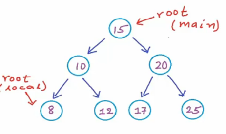

### 31) Find height of a binary tree

**Height of tree** is the number of edges in longest path from root to node or can be the height or root. Height of tree with 1 node is zero.

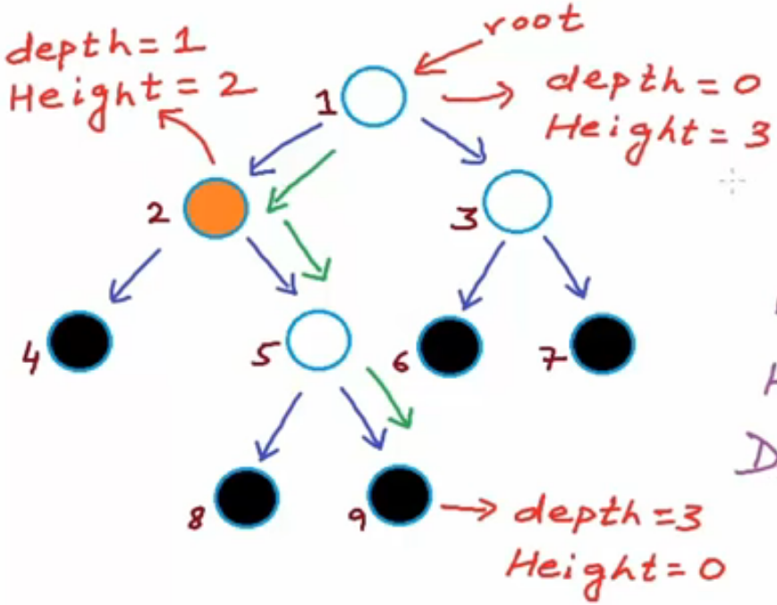

```C++
struct BstNode {
    int data;
    BstNode* left;
    BstNode* right;
};

int FindHeight(struct Node *root)
{
    if(root == NULL)
        return -1;
    return max(FindHeight(root->left), FindHeight(root->right)) + 1;
}
```

### 32) Binary tree traversal - breadth-first and depth-first strategies

**Tree traversal** - process of visiting each node in the tree exactly once in some order. Two categories: breadth-first and depth-first.

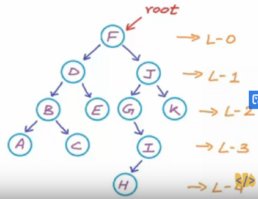

Breadt-first: F, D, J, B, E, G, K, A, C, I, H. Level-order.
Depth-first:

- ```<root><left><right>``` - preorder: F, D, B, A, C, E, J, G, I, H, K;
- ```<left><root><right>``` - inorder: A, B, C, D, E, F, G, H, I, J, K;
- ```<left><right><root>``` - postorder: A, C, B, E, D, H, I, G, K, J, F;

### 33) Binary tree: Level Order Traversal

In level order traversal, we visit all nodes at a particular depth or level before visiting the nodes at next deeper level.

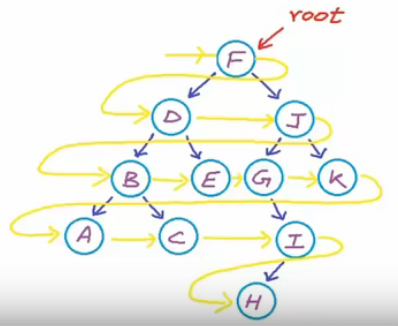

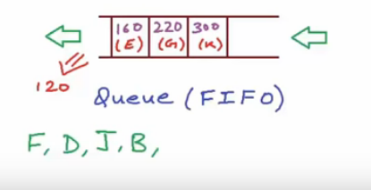

Queue (FIFO): F, D, J, B, E, G, K, A, C, I, H;

```C++
#include<iostream>
#include<queue>

using namespace std;

struct Node{
    char data;
    Node *left;
    Node *right;
};

// Function to print Nodes in a binary tree in Level order
void LevelOrder(Node *root) {
    if(root == NULL) return;
    queue<Node*> Q;
    Q.push(root);  
    //while there is at least one discovered node
    while(!Q.empty()) {
        Node* current = Q.front();
        Q.pop(); // removing the element at front
        cout<<current->data<<" ";
        if(current->left != NULL) Q.push(current->left);
        if(current->right != NULL) Q.push(current->right);
    }
}
// Function to Insert Node in a Binary Search Tree
Node* Insert(Node *root,char data) {
    if(root == NULL) {
        root = new Node();
        root->data = data;
        root->left = root->right = NULL;
    }
    else if(data <= root->data) root->left = Insert(root->left,data);
    else root->right = Insert(root->right,data);
    return root;
}

int main() {
    /*Code To Test the logic
    Creating an example tree
                M
               / \
              B   Q
             / \   \
            A   C   Z
    */
    Node* root = NULL;
    root = Insert(root,'M'); root = Insert(root,'B');
    root = Insert(root,'Q'); root = Insert(root,'Z');
    root = Insert(root,'A'); root = Insert(root,'C');
    //Print Nodes in Level Order.
    LevelOrder(root);
}
```

Time complexity: O(n). Space complexity: O(1) for best, O(n) for worst/average.

### 34) Binary tree traversal: Preorder, Inorder, Postorder

```C++
struct Node {
    char data;
    Node *left;
    Node *right;
};

/*
             F
           /   \
          D     J
         / \   / \
        B   E G   K
       / \     \
      A   C     I
*/

void Preorder(Node *root) // F D B A C E J G I K
{
    if(root == NULL) return;

    printf("%c ", root->data);
    Preorder(root->left); // recursive call for left subtree
    Preorder(root->right);
}

void Inorder(Node *root) // A B C D E F G H I J K
{
    if(root == NULL) return;

    Inorder(root->left);
    printf("%c ", root->data);
    Inorder(root->right);
}

void Postorder(Node *root) // A C B E D I G K J F
{
    if(root == NULL) return;
    Postorder(root->left);
    Postorder(root->right);
    printf("%c ", root->data);
}
```

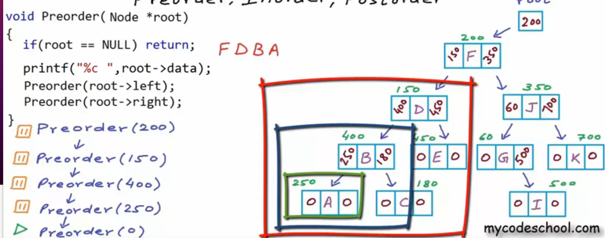

- Time complexity: O(n)
- Space complexity: O(height) [worst: O(n), best/average: O(logn)]

### 35) Check if a binary tree is binary search tree or not

**Binary Search Tree** (BST) - a binary tree in which for each node, value pf all the nodes in left subtree is lesser (or equal) and value of all the nodes in right subtree is greater.


```C++
bool IsSubtreeLesser(Node* root, int value);

bool IsSubtreeGreater(Node* root, int value)
{
    if(root == NULL) return true;
    if(root->data > value)
       && IsSubtreeGreater(root->left, value)
       && IsSubtreeGreater(root->right, value))
        return true;
    else
        return false;
}

bool IsBinarySearchTree(Node* root)
{
    if(root == NULL) return true;

    if(IsSubtreeLesser(root->left, root->data)
       && IsSubtreeGreater(root->right, root->data)
       && IsBinarySearchTree(root->left)
       && IsBinarySearchTree(root->right))
        return true;
    else
        return false;
}

// time complexty - O(n²)
```

```C++
// better way to do it
bool IsBstUtil(Node* root, int minValue, int maxValue)
{
    if(root == NULL) return true;

    if(root->data < minValue && root->data > maxValue
       && IsBstUtil(root->left, minValue, root->data)
       && IsBstUtil(root->right, root->data, maxValue))
        return true;
    else
        return false;
}

bool IsBinarySeachTree(Node* root)
{
    return IsBstUtil(root, INT_MAX, INT_MIN);
}

// time complexity - O(n)
```

### 36) Delete a node from Binary Search Tree

Deleting a node from BST:

- case 1: no child;
- case 2: one child;
- case 3: 2 children.
  - find min in right: copy the value in targetted node, delete duplicate from right-subtree;
  - find max in left: copy the value in targetted node, delete duplicate from left-subtree;

```C++
struct Node* Delete(struct Node *root, int data)
{
    if(root == NULL) return root;
    else if(data < root->data) root->left = Delete(root->left, data);
    else if(data > root->data) root->right = Delete(root->right, data);
    else
    {
        // Case 1: no child
        if(root->left == NULL && root->right == NULL)
        {
            delete root;
            root = NULL;
        }
        // Case 2: one child
        else if(root->left == NULL)
        {
            struct Node *temp = root;
            root = root->right;
            delete temp;
        }
        else if(root->right == NULL)
        {
            struct Node *temp = root;
            root = root->right;
            delete temp;
        }
        // case 3: 2 children
        else{
            struct Node *temp = FindMin(root->right);
            root->data = temp->data;
            root->right = Delete(root->right, temp->data);
        }
    }
    return root;
}
```

### 37) Inorder Successor in a binary search tree
